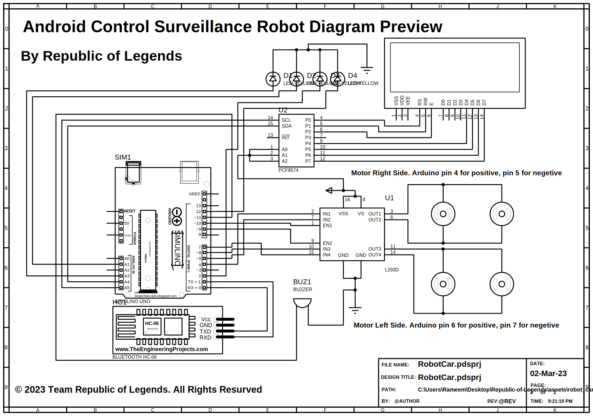

# Android Control Surveillance Robot Project by

## Republic of Legends

### **All members are working and adding code on this firmware using GITHUB**

### **Currently working on bluetooth communication, LED and sound notification**

<br>

<!-- > **Warning :**
> Bug Found in sound function -->

```
                   oooo    .oooooo.    .oooooo..o
                   `888   d8P'  `Y8b  d8P'    `Y8
oooo d8b  .ooooo.   888  888      888 Y88bo.
`888""8P d88' `88b  888  888      888  `"Y8888o.
 888     888   888  888  888      888      `"Y88b
 888     888   888  888  `88b    d88' oo     .d8P
d888b    `Y8bod8P' o888o  `Y8bood8P'  8""88888P'

```

[]()


<br>
<br>

## Main Developer: **Mahmood Hassan Rameem**

## Our Director: **Fahmida Yeasmin**

## Our Team: **Team Republic of Legends**

## _Studing Diploma Engineering_

## _Computer Technology_

## **_Institute of Science Trade & Technology, Dhaka._**

<br>

# Project Overview

### This is a prototype project of **ROBOT CAR** based on **ARDUINO development board** by <b>Republic of Legends</b>. Currently it is in **BETA** stage. We are setuping our robot and maintaining stability of our robot. Also we are working on **ROBOT Firmware** . Soon we release and implement the firmware.

---

<br>

# Project Members and Contributors

## 1. Director, Programmer & Manager

- ## Fahmida Yeasmin

## 2. Main programmer and co-manager

- ## Mahmood Hassan Rameem

## 3. Other's Contributors

- ## Jahedul Islam Rasel
- ## Mahabul Alam
- ## Abdul Baten
- ## Pabel pathan
- ## Maysha Siddiqi
- ## Reetu Rahman

<br>
<br>

# Components

- ## Arduino UNO x 1 [](LINK)
- ## LCD Display 16/2 I2C Driver (Optional)
- ## LCD Display 20/4 I2C Driver x 1 [](LINK)
- ## I2C LCD Driver x 1 [](LINK)
- ## L298N Motor Driver IC x 1 [](LINK)
- ## Robot car body x 1 [](LINK)
- ## HC - 06 Bluetooth x 1 [](LINK)
- ## Battery x 4 [](LINK)
- ## Battery Case x 1 [](LINK)
- ## Wires [](LINK)
- ## Bread Board x 1 [](LINK)

---


# Round Figure Budget 8000 TK Apprx

---

<br>
<br>

# Project Circuit Diagram



# Robot all connection

## Right side motor:

### Arduino digital pin 4 >>> L298N Driver input 1 (Positive)

### Arduino digital pin 5 >>> L298N Driver input 2 (Negetive)

<br>
<br>

## Left side motor:

### Arduino digital pin 6 >>> L298N Driver input 3 (Positive)

### Arduino digital pin 7 >>> L298N Driver input 4 (Negetive)

<br>
<br>

## LCD Display 20/4 I2C:

### Arduino analog pin A4 >>> I2C Driver SDA pin

### Arduino analog pin A5 >>> I2C Driver SCL pin

<br>
<br>

## Bluetooth module HC-06:

### Arduino pin RX >>> HC-06 TX pin

### Arduino pin TX >>> HC-06 RX pin

<br>
<br>

# Project Screen Shot

### Coming Soon

<br>
<br>

# Robor Car Controller App

[](https://play.google.com/store/apps/details?id=com.buncaloc.carbluetoothrc&hl=en)


# We are Legends (☺)

| Fahmida Yeasmin                                                                                          | Mahmood Hassan Rameem                                                                                                          |
| -------------------------------------------------------------------------------------------------------- | ------------------------------------------------------------------------------------------------------------------------------ |
| [](LINK)      | [](LINK)                    |
|  |  |

<br>
<br>

| Jahedul Islam Rasel                                                                                          | Mahabul Alam                                                                                                  |
| ------------------------------------------------------------------------------------------------------------ | ------------------------------------------------------------------------------------------------------------- |
| [](LINK)                        | [](LINK)                         |
|  |  |

<br>
<br>

| Abdul Baten                                                                                            | Pabel Pathan                                                                                            |
| ------------------------------------------------------------------------------------------------------ | ------------------------------------------------------------------------------------------------------- |
| [](LINK)                  | [](LINK)                   |
|  |  |

<br>
<br>

| Maysha Siddiqi                                                                                          | Reetu Rahman                                                                                                 |
| ------------------------------------------------------------------------------------------------------- | ------------------------------------------------------------------------------------------------------------ |
| [](LINK)                   | [](LINK)                        |
|  |  |

---

## Thanks for being with us.

## Keep Code

---

### © 2022 Team Republic of Legends. All Rights Resurved.
